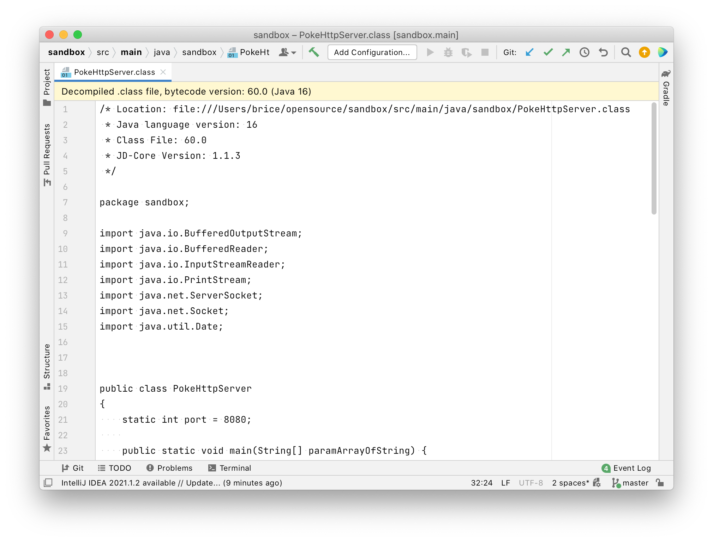

= JD-IntelliJ

Install https://plugins.jetbrains.com/plugin/7100[JD-IntelliJ plugin] via the JetBrains plugin repository.

== Presentation

*JD-IntelliJ* is a plug-in for *IntelliJ IDEA*, initiated by *Brice Dutheil*.
It uses the *Java Decompiler* binaries It allows you to display all the Java sources during your debugging process, even if you do not have them all.
Currently, the project is under development.

Your contributions are welcome.

Also note that it is possible to decompile jars/classes with *JD-GUI* (can be found on the official site).

== Warning

This plugin is currently partly maintained, due to lack of time and, due to the availability of a decompiler within https://www.jetbrains.com/idea/features/#built-in-tools[IntelliJ IDEA itself]
(even the https://www.jetbrains.com/idea/features/editions_comparison_matrix.html[community version]).

IntelliJ IDEA's decompiler is based on a fork of Fernflower (See https://github.com/JetBrains/intellij-community/tree/master/plugins/java-decompiler[here]).

== Notes

It is the official https://github.com/java-decompiler/jd-core[*Java Decompiler*] plugin for IntelliJ IDEA.

Last but not the least, all the credit for decompilation stuff must go to
*Emmanuel Dupuy*, who is the author of Java Decompiler.

== Installation

.From the JetBrains repository
The plugin is published on the public JetBrains IntelliJ repository, to install it go to
the _Settings_ dialog window &gt; _Plugins_ pane &gt; _Browse Repositories_ dialog
window, then search for _Java Decompiler_.

.From the zip archive
It is also possible to install JD-IntelliJ from a file (if compiled from the source),
to the _Settings_ dialog window &gt; _Plugins_ pane &gt; _Install Plugin from disk…_

*Don't download from Github!* The Github link is the zipped git repository, not the
actual plugin.You can find the latest version on the
https://plugins.jetbrains.com/plugin/7100[IntelliJ IDEA plugin site].

== Development

.First steps
____
The plugin uses the new https://github.com/JetBrains/gradle-intellij-plugin[Gradle]
based infrastructure to build plugins. Currently, the target is IntelliJ 2021.1.
____

. Clone from github
. Import it on IntelliJ IDEA from the `build.gradle` project descriptor
. Run the new configuration

.Building it
So, to create the plugin zip archive (with the custom repository file) in the `deploy` folder, enter the following at
root of the project :

----
./gradlew buildPlugin
----

[source,properties]
----
# Version of the plugin
version=0.7.1

# Base URL where the plugin ZIP file will be deployed
plugin.deploy.url=https://arkey.fr/jd-intellij
----

.Interesting IntelliJ Plugin development links
For development purpose, you can take a look here :

* http://tomaszdziurko.pl/2011/09/developing-plugin-intellij-idea-some-tips-and-links/
* http://confluence.jetbrains.net/display/IDEADEV/PluginDevelopment
* http://www.jetbrains.org/intellij/sdk/docs/tutorials/build_system.html[Plugins using gradle build system]
* https://blog.jetbrains.com/platform/